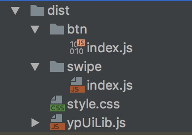

> 前段时间一直在研究Vue组件库，终于在组内派上了用场。来给大家贡献一篇关于Vue组件库的相关知识。经验不多，如果有不合理的地方还请多多指出哦～～～

回想一下，在你们公司或者你们小组是否有一个以上的项目需要你维护？你是否遇到两个项目需要开发类似的功能的情况？那么你是怎么做的呢？

**有这么三种通俗的解决方案：**

- **COPY** 你可能会说我讲究速度，复制之前的组件到新项目中，慢慢的你会发现随着你的项目的增加代码量在成倍上升，重复工作浪费了你很多时间。
- **子模块** 我可以抽离出所有公共的组件放入一个子模块（git submodule）中，这种方式虽然解决了重复工作，但对目录结构以及使用者的要求比较多，不够灵活，还是不满意。。。
- **使用开源组件库** 这可能是一个好的选择，但是，一用才发现很多并不是我们想要的，尤其是移动端组件库：
    - 有些组件产品并不是想要那样做，你还是需要自己写
    - 移动端的UI风格差异较大
    - 不同终端的适配方案不同rem/px/vw等。

所以就写一个自己想要的组件库吧！**我们以一个简单的vue移动端组件库为例讲一下重点部分：**

需要具备以下基础：

- 有一定的Vue webpack babel基础
- 了解过如何开发Vue的插件或库

1.把公共组件放入components目录中，并编写导出文件如下：
```javascript
// src/index.js
import Btn from './components/btn'
import Swipe from './components/swipe'
const install = function(Vue) {
  if (install.installed) return;
  // 此处注意：组件中需要添加name属性，代表注册的组件名，也可修改成其他
  Vue.component(Btn.name, Btn)
  Vue.component(Swipe.name, Swipe)
}
// Vue 是全局变量时，自动 install
if (typeof window !== 'undefined' && window.Vue) {
  install(window.Vue);
};
module.exports = {
  install,
  Btn,
  Swipe
}
```
此处需要注意的是`install`。`Vue`的插件必须提供一个公开方法`install`，该方法会在你使用该插件，也就是` Vue.use(yourPlugin) `时被调用。这样也就给`Vue`全局注入了你的所有的组件。

2.webpack配置
```javascript
var path = require('path')
var options = require('./webpack.base')
var merge = require('webpack-merge')
var webpack = require('webpack')
var ExtractTextPlugin = require('extract-text-webpack-plugin')

module.exports = merge(options, {
  entry: path.resolve(__dirname, '../src/index.js'),
  output: {
    filename: 'UiLib.js',
    path: path.resolve(__dirname, '../dist'),
    library: 'UiLib',
    libraryTarget: 'umd' // commonjs2
  },
  externals: {
    vue: {
      root: 'Vue',
      commonjs: 'vue',
      commonjs2: 'vue',
      amd: 'vue'
    }
  },
  plugins: [
    new ExtractTextPlugin({
      filename: './style.css',
      disable: false,
      allChunks: true
    })
  ]
})
```
这里需要注意：必须加上externals（产出文件不打包vue）和library，libraryTarget（打包产出模式）。可以去webpack官网查看详细说明。样式需要单独打包出来，否则打包的js文件过大影响性能。

3.在package.json中添加：
```json
{
    "main": "dist/UiLib.js", // 引用的入口文件
    "name": "vue-ui-lib",
    "version": "0.0.1"
}
```
到此一个简单的组件库就可以publish了，赶快试试吧。那发布后如何使用呢

4.引用
```
npm i vue-ui-lib [--register] [服务器地址]
```
```javascript
// index.js
import UiLib from 'vue-ui-lib'
Vue.use(UiLib)
```
```vue
// test.vue 组件名即上边提到的组件中的name属性，由自己定义
<btn ...></btn>
<swipe ...></swipe>
```
这样虽然通了，可是我要修改组件，测试组件效果怎么办？很明显，需要一个demo做测试。

5.创建demo，并在demo的入口文件中引入
```javascript
// demo/index.js
import UiLib from '../src/index'
Vue.use(UiLib)
```
然后按照类似你的项目中的webpack配置一样配置好，你的测试也就能跑通了。可是，你又发现有些项目只用一个组件，但Vue.use后会把所有的组件引入。
所以如何做到按需引入组件呢？首先想到的就是webpack的多入口文件啦。

6.按需引入
```javascript
module.exports = merge(options, {
  // 举例
  entry: {
    'btn': path.resolve(__dirname, '../src/components/btn/index.js'),
    'swipe': path.resolve(__dirname, '../src/components/swipe/index.js')
  },
  output: {
    filename: '[name]/index.js',
    path: path.resolve(__dirname, '../dist'),
    library: 'ypUiLib',
    libraryTarget: 'umd'
  }
})
```
这样产出后在dist目录下就会出现btn, swipe目录。

那么按需引入怎么引入呢？
```
import Btn from 'vue-ui-lib/dist/btn'
Vue.component(Btn.name, Btn)
或者
components: {
    Btn
}
// 但是很多使用过组件库的人会有疑问，应该是这样的吧？
import {Btn} from 'vue-ui-lib'
```
第二种引用方式引用的是model.exports的导出文件，是全部引入的（亲测是全部引入）。针对这个问题ant-design提供了一种解决方案：引入npm包`babel-plugin-import`，这个包的原理是修改babel解析过程，配置到项目中后就会解析成第一种形式的代码。

按需引用的css可以分开打包，但这样会造成使用者的麻烦，所以直接引入所有的css可能是最好的选择。当然如果样式比较少的话，也可以直接打包到js中。

> 前面主要讲了组件库的两个核心思想的实现：全局引用和按需引用。接下来从两个角度出发说一些注意事项：

### 从使用者角度出发

- css管理

使用者会说修改组件库的样式怎么这么难呢？一看发现是组件中用了css modules或者层级嵌套太深，或者是在vue的style中写了scoped。
可是去掉这些又会导致全局样式出现，万一跟用户定义的class重名怎么办，所以我们就需要**class命名规范**，可以用postcss的@component-namespace name {...}统一管理。

```vue
// bad 使用者不好修改组件样式
<style lang="scss" scoped>
.loading {
    color: red;
    .box {
        width: pxToRem(60px);
    }
}
...
</style>

// good 这样命名都加了前缀，并且没有层级嵌套
<style lang="scss">
//统一如下zzyp-[组件名]-[other]...
.zzyp-loading {
  position: fixed;
  top: 0;
  &-box {
    width: pxToRem(60px);
  }
  ...
}
</style>
```

- 版本控制

1. **依赖包的版本** 为了让使用者安装的时候不会因为版本不一样出现一些不可预料的错误，我们需要package lock，可以使用npm 5的lock，也可以使用yarn管理
2. **自身版本** 控制好自身版本，一般版本号是`x.y.z`,尽量避免手动修改package.json。可以用`npm version <update_type>`自动生成。`update_type`三选一`patch/minor/major`分别对应补丁，新特性，很大的改动。

- 说明文档

1. demo和文档最好放到一起，示例越多越好
2. 属性，方法，slot等必须都写清楚含义默认值等

#### 从开发者角度出发

1. js提取所有公共模块，工具函数等
2. 为了提高开发效率，可以写一些自动生成文件，比如src/index.js等
3. 开发文档需要写清楚，并且写清楚需要遵守的规范

> 现在组件库的基本功能完成啦。其实这只是最基础的部分，还有很多性能，组件内部如何设计等都没有讲到。如果要做一个复杂的通用组件库要考虑的还有很多很多，可以去看看各位大神们是如何设计的，我就不误导大家啦，吼吼～～～